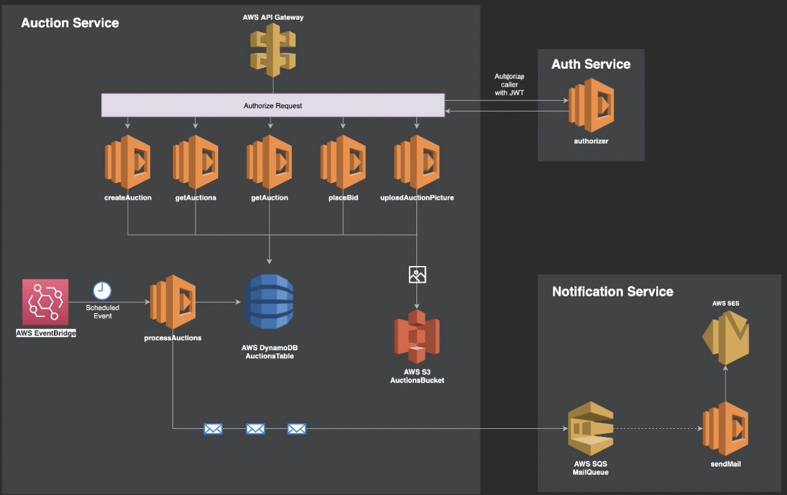

# Serverless Architecture based Auction Project

A course from Udemy by Ariel Weinberger

## Project Description

Using AWS's multiple services like Lambda, DynamoDB, S3, SES, SQS, API Gateway, etc., a Server-less Architecture Project has been written. The Auction Service works as a Microservice, not as a Monolithic Application. Since it uses the Cloud strategy of deployment, it uses Serverless framework and YAML style definition of code

## Architecture

Below is a simple architecture with multiple AWS resources  

## Requirements

- AWS Account
- AWS-CLI v2
- NodeJS (ver. < 15.3.x) and npm
- serverless framework (`npm install -g serverless`)
- Configuring aws locally (`aws configure`)
- Postman or Thunder-Client(plugin for VS-Code)

## Getting started

`cd auction-service`  
`npm install`  
`serverless deploy --verbose`  
